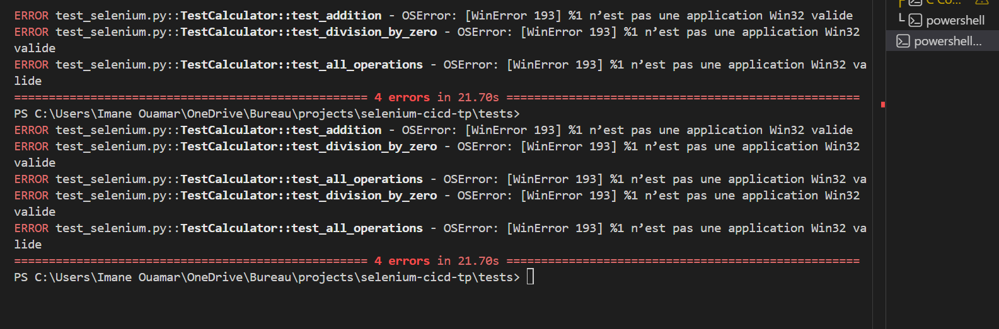

Avantages observés

Avantages de l'automatisation des tests : Gain de temps et détection rapide des bugs.

Comment le CI/CD améliore la qualité du code : Il teste et déploie automatiquement les versions stables.

2. Défis rencontrés

Difficultés avec Selenium : Problèmes de synchronisation et de drivers.

Comment améliorer la stabilité des tests : Ajouter des attentes explicites et tests robustes.

3. Métriques

Métriques importantes pour le projet : Couverture de tests et temps de chargement.

Comment mesurer l’efficacité du pipeline CI/CD : Vérifier les tests passés et le temps d’exécution.